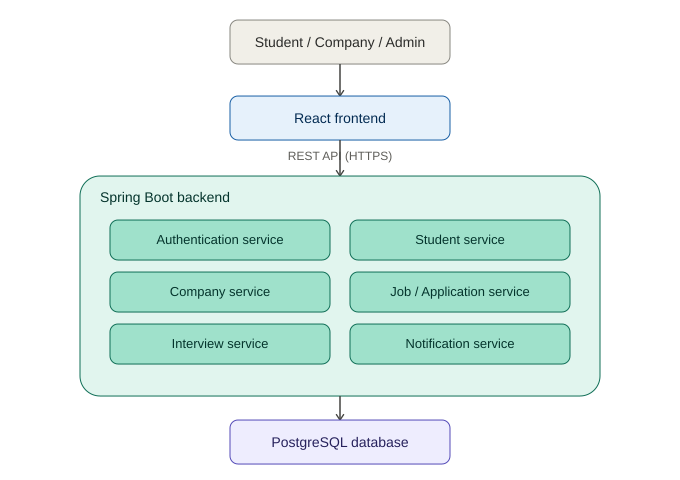
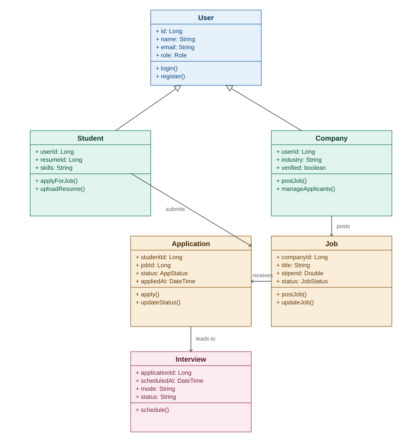
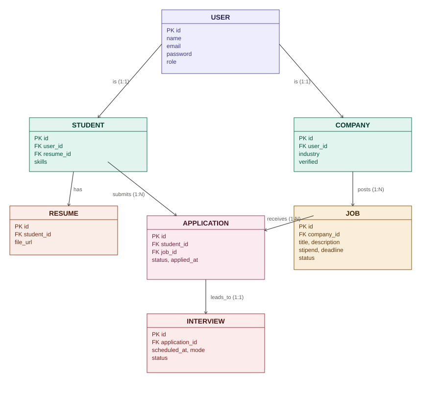

# 🎓 Internship & Campus Hiring Platform

A modern, secure, and modular internship and campus hiring platform built with Spring Boot 3.x, Java 17, and React 18 (Vite).

## 🌟 Features & Key Modules
=======
👨‍💻 Author

Name: Deepthi fonsiya Zenofar S
department:B.Tech IT 
year :III (Pre-Final Year)
College Name:JJ College Of Engineering And Technology
Role: Fullstack Developer

🌟 Features & Key Modules
**Role-Based Authentication & Authorization (RBAC)**
- Roles: `ADMIN`, `STUDENT`, `COMPANY`.
- JWT-ready stateless security architecture.

**Student Profile & Resume Management**
- Digital registration with full name, contact details, academic info, skillset, and resume upload.

**Internship & Job Listing Management**
- Company-driven job/internship posting linked to recruiter accounts.
- Listing status tracking (`OPEN`, `CLOSED`, `EXPIRED`).

**Application & Tracking Workflow**
- Students apply to listings with automatic status updates (`APPLIED`, `SHORTLISTED`, `REJECTED`, `SELECTED`).

**Interview Scheduling**
- Interview creation linked to shortlisted applications, with mode, timestamp, and status tracking (`SCHEDULED`, `COMPLETED`, `CANCELLED`).

**Admin Oversight & Reports**
- Verifies student and company accounts, moderates job postings, and views platform-wide placement statistics.

---

## 🏗️ Architecture & Diagrams

### 1. System Architecture Diagram



### 2. UML Class Diagram



### 3. Entity-Relationship (ER) Schema




---

## 🛠️ Technology Stack

| Layer | Technology | Description |
|---|---|---|
| **Frontend** | React 18 (Vite) + CSS | Modular Single Page Application with Navbar, Sidebar, Context Providers, and Dashboard views. |
| **Backend** | Java 17 + Spring Boot 3.x | Layered REST API architecture (controller, service, repository, model, dto, exception, util). |
| **Security** | Spring Security | Encrypted passwords (BCrypt), CORS filters, and custom JWT request filter. |
| **Database** | PostgreSQL / H2 | Relational schema with JPA Hibernate ORM (users, students, companies, jobs, applications, interviews). |

---
📁 Repository Directory Structure

```
internship-campus-hiring-platform/
├── .env.example
├── .gitignore
├── CHANGELOG.md
├── LICENSE
├── Problem_Statement.md
├── README.md
│
├── docs/
│   ├── architecture_diagram.png
│   ├── class_diagram.png
│   ├── er_diagram.png
│   ├── schema.dbml                           # Source DBML schema for dbdiagram.io
│   ├── diagrams/
│   │   ├── architecture.md                   # System Architecture documentation
│   │   ├── class_diagram.md                  # UML Class & Module diagram documentation
│   │   └── schema.dbml
│   └── screenshots/
│       ├── login_page.png
│       ├── dashboard.png
│       └── job_listings.png
│
├── backend/                                  # Java 17 + Spring Boot REST API
│   ├── .env.example
│   ├── pom.xml                               # Maven Build Dependencies
│   └── src/
│       ├── main/
│       │   ├── java/com/college/internshipplatform/
│       │   │   ├── InternshipPlatformApplication.java
│       │   │   ├── config/                   # SecurityConfig, JwtFilter, CorsConfig
│       │   │   ├── controller/               # AuthController, StudentController, CompanyController, JobController, ApplicationController, InterviewController
│       │   │   ├── service/                  # Service interfaces (UserService, JobService, ApplicationService, etc.)
│       │   │   ├── service/impl/             # Service implementations (UserServiceImpl, etc.)
│       │   │   ├── repository/               # UserRepository, JobRepository, ApplicationRepository, etc.
│       │   │   ├── model/
│       │   │   │   ├── entity/               # User, Student, Company, Job, Application, Interview
│       │   │   │   └── enums/                # Role, JobStatus, ApplicationStatus
│       │   │   ├── dto/                      # LoginRequest, LoginResponse, JobRequest, ApplicationResponse, etc.
│       │   │   ├── exception/                # ResourceNotFoundException, GlobalExceptionHandler
│       │   │   └── util/                     # JwtUtil, ValidationUtil
│       │   └── resources/
│       │       ├── application.properties
│       │       ├── application-dev.properties
│       │       └── data.sql                  # Initial database seed file
│       └── test/
│           └── java/com/college/internshipplatform/
│               └── InternshipPlatformApplicationTests.java
│
└── frontend/                                 # React 18 + Vite Frontend Application
    ├── .env.example
    ├── index.html
    ├── package.json
    ├── vite.config.js
    ├── public/
    │   ├── logo.png
    │   └── favicon.ico
    └── src/
        ├── main.jsx
        ├── App.jsx
        ├── App.css
        ├── index.css
        ├── api/                              # axiosConfig.js, jobApi.js
        ├── components/                       # Navbar, Sidebar, Card, Loader
        ├── context/                          # AuthContext, UserContext
        ├── pages/                            # Login, Dashboard, Jobs, Applications, Interviews, Profile
        └── utils/                            # constants.js, helpers.js
```

---
 🚀 Quick Start Guide

### Prerequisites
- Java JDK 17+
- Apache Maven 3.8+
- Node.js 18+ & npm

### 1. Run Backend Service
```bash
cd backend
mvn clean compile
mvn spring-boot:run
```
Backend REST API will start at: `http://localhost:8080`
Embedded H2 Console available at: `http://localhost:8080/h2-console`

### 2. Run Frontend Client
```bash
cd frontend
npm install
npm run dev
```
React Frontend app will start at: `http://localhost:5173`

---
📜 License

This project is licensed under the terms of the **MIT License**.
